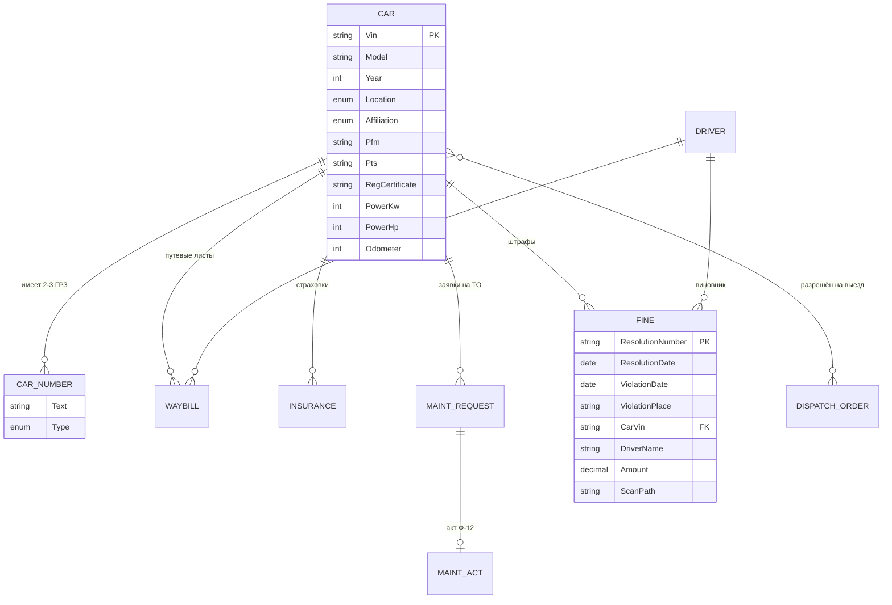
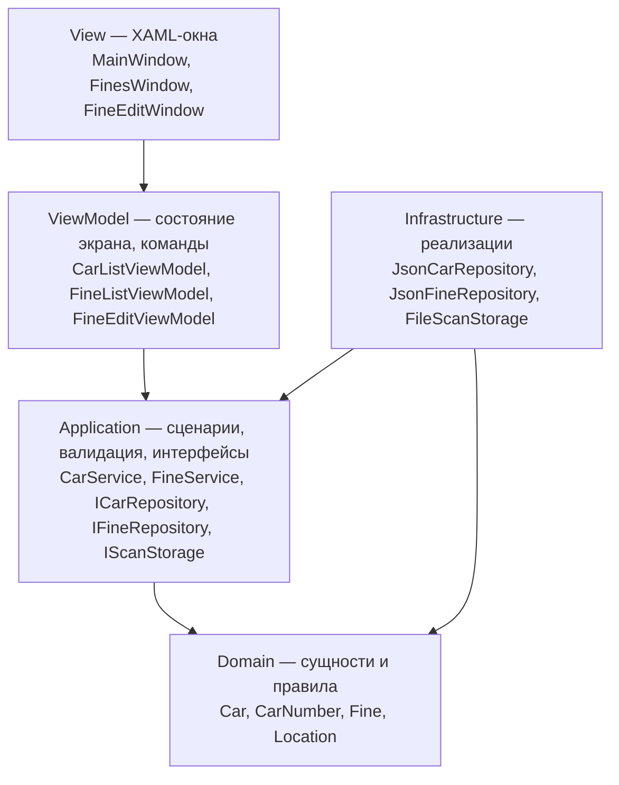

# ParkApp — дизайн-документ

**Версия:** 1.0
**Статус:** черновик к согласованию
**Основано на:** `docs/requirements/AutoPark.md` (исходные требования заказчика)

---

## 1. Назначение

ParkApp — настольное приложение для учёта автопарка воинской части / автохозяйства.
Заменяет ведение учёта в бумажных журналах и разрозненных Excel-файлах.

Приложение решает четыре задачи:

1. **Реестр техники** — единый список машин с документами и наработкой.
2. **Оперативный учёт** — путевые листы, наряды на выход техники, местонахождение.
3. **Сопровождение** — страховки (ОСАГО), заявки на ТО, акты Ф-12, штрафы.
4. **Архив сканов** — привязка PDF-сканов документов к записям и быстрое открытие.

### Границы (что НЕ входит)

- Бухгалтерия, зарплата, ГСМ-расчёты.
- Интеграция с ГИБДД/ФНС (штрафы вносятся вручную).
- Мобильный клиент.
- Разграничение прав доступа (в v1 приложение однопользовательское).

---

## 2. Пользователи и сценарии

| Роль | Кто это | Что делает в системе |
|---|---|---|
| Диспетчер | ведёт ежедневный учёт | путевые листы, наряд на выход, местонахождение машин |
| Техник / зампотех | отвечает за исправность | заявки на ТО, акты Ф-12, наработка |
| Делопроизводитель | ведёт документы | страховки, штрафы, сканы, отчёты |

Ключевые сценарии:

- **С1.** Найти машину по гос. номеру или VIN и увидеть все её документы и сканы.
- **С2.** Внести пришедшее постановление о штрафе, приложить скан, указать водителя.
- **С3.** Узнать, какие ОСАГО истекают в ближайшие 30 дней.
- **С4.** Сформировать наряд на выход техники на дату.
- **С5.** По заявке на ТО сгенерировать акт Ф-12 в Word.
- **С6.** Отчёт: сумма штрафов за период / по машине / по водителю.

---

## 3. Глоссарий

| Термин | Значение |
|---|---|
| **ГРЗ** | государственный регистрационный знак (гос. номер). У машины 2–3 знака: войсковой и гражданский |
| **VIN** | идентификационный номер кузова, 17 символов, бизнес-ключ машины |
| **ПТС** | паспорт транспортного средства |
| **СРТС / СТС** | свидетельство о регистрации ТС |
| **ПФМ** | номер по формуляру машины |
| **Наработка** | пробег в км (для колёсной) / моточасы (для спецтехники) |
| **Наряд на выход** | суточный документ со списком машин, которым разрешён выезд из парка |
| **Ф-12** | форма акта технического обслуживания |
| **Постановление** | документ о назначении административного штрафа, его номер — ключ штрафа |

---

## 4. Модель данных

### 4.1 Схема сущностей



### 4.2 Ключи: решение

Требования фиксируют «VIN (первичный ключ)». Принято следующее:

- **VIN — бизнес-ключ машины.** Уникален, обязателен, по нему идут все ссылки в JSON-файлах v1.
- Поле `Guid Id` в `Car` **остаётся** (уже есть в коде), но используется только как технический идентификатор внутри процесса.
- **Внешние ключи ссылаются на VIN**, а не на `Guid Id`. Причина: текущий `JsonCarRepository` при отсутствии `cars.json` создаёт демо-машины с `Guid.NewGuid()` и **не сохраняет их**, поэтому Id меняется при каждом запуске — любые FK по Id разваливаются. VIN стабилен.
- При переезде на СУБД (раздел 10) вводится суррогатный `int/Guid PK` + `UNIQUE (Vin)`, а FK переводятся на суррогат. Причина: VIN в реальности иногда правят из-за опечатки, а бизнес-ключ править дорого.

**Правило:** ссылки на машину везде называются `CarVin`, чтобы при миграции их было тривиально найти.

### 4.3 Сущности

#### Машина (`Car`) — есть частично

| Поле | Тип | Обяз. | Примечание | Статус |
|---|---|---|---|---|
| `Vin` | string(17) | да | бизнес-ключ, уникален | есть |
| `Model` | string | да | «Урал-4320», «BMW» | есть |
| `Numbers` | List\<CarNumber\> | да, ≥1 | 2–3 ГРЗ на машину | есть |
| `Location` | enum | да | местонахождение №1 / №2 | есть, **см. открытый вопрос О-1** |
| `Year` | int | да | год выпуска, 1950…текущий+1 | есть |
| `Pfm` | string | нет | ПФМ | **нет** |
| `Pts` | string | нет | ПТС | **нет** |
| `RegCertificate` | string | нет | свид. о регистрации (СРТС) | **нет** |
| `PowerKw` / `PowerHp` | int / int | нет | «220/299» → два поля | **нет** |
| `Affiliation` | enum | да | Гараж / Обеспечение | **нет** |
| `Odometer` | int | да | наработка, км | **нет** |
| `Attachments` | List\<Attachment\> | нет | сканы СРТС, ОСАГО и т.д. | **нет** |

`CarNumber { Text, Type }`, `NumberType { Army, NoArmy }` — уже реализовано.

Мощность хранится **двумя числами** (кВт и л.с.), а не строкой «220/299»: строка не сортируется и не фильтруется, а формат ввода фиксирован. На UI отображается как «220/299» через форматтер.

#### Путевой лист (`Waybill`)

| Поле | Тип | Примечание |
|---|---|---|
| `Number` | string | номер путевого листа |
| `CarVin` | string FK | машина |
| `DriverName` | string | водитель |
| `StartAt` | DateTime | дата+время начала |
| `EndAt` | DateTime? | дата+время конца, пусто = машина в рейсе |
| `OdometerStart` / `OdometerEnd` | int? | для автоподсчёта наработки |

Требования разделяют дату и время. В модели хранится **один `DateTime`**, а в UI это два контрола (`DatePicker` + маска времени) — так проще сравнивать интервалы и считать «машина в рейсе сейчас».

#### Наряд на выход техники (`DispatchOrder`)

| Поле | Тип |
|---|---|
| `Date` | DateTime (дата наряда, уникальна) |
| `AllowedCarVins` | List\<string\> |

#### Страховка (`Insurance`)

| Поле | Тип | Правило |
|---|---|---|
| `PolicyNumber` | string PK | уникален, вводится пользователем |
| `CarVin` | string FK | |
| `StartDate` / `EndDate` | DateTime | `EndDate > StartDate` |
| `ScanPath` | string | скан ОСАГО |

Производное: «истекает через N дней» — вычисляется, не хранится.

#### Заявка на ТО (`MaintenanceRequest`)

| Поле | Тип |
|---|---|
| `Number` | string PK |
| `Date` | DateTime |
| `CarVin` | string FK (модель и номер тянутся из машины) |
| `Odometer` | int (наработка на момент заявки) |
| `OdometerSinceLastRepair` | int |
| `LastRepairDate` | DateTime? |
| `ServiceKinds` | List\<string\> (вид ТО — что обслужить) |
| `ScanPath` | string |

#### Акт ТО Ф-12 (`MaintenanceAct`)

Отдельная сущность-надстройка над заявкой; почти всё вычисляемое:

| Поле | Источник |
|---|---|
| `RequestNumber` | FK на заявку |
| данные машины | из `Car` |
| текущая наработка | из `Car.Odometer` |
| макс. наработка | **формула, см. открытый вопрос О-2** |
| остаток наработки | макс. − текущая |
| текст акта | генерируется из `ServiceKinds` заявки по шаблону |
| `DocxPath` | сгенерированный .docx |

#### Штраф (`Fine`) — реализован в прототипе

| Поле | Тип | Обяз. | Правило |
|---|---|---|---|
| `ResolutionNumber` | string PK | да | номер постановления, уникален, не редактируется после создания |
| `ResolutionDate` | DateTime | да | не в будущем |
| `ViolationDate` | DateTime | да | не в будущем, ≤ `ResolutionDate` |
| `ViolationPlace` | string | нет | по требованиям — опционально |
| `CarVin` | string FK | да | выбор из списка машин |
| `DriverName` | string | нет | может быть неизвестен: постановление приходит на владельца |
| `Amount` | decimal | да | > 0, рубли |
| `ScanPath` | string | нет | относительный путь к скану постановления |

#### Водитель (`Driver`) — в требованиях явно не описан

Водитель упоминается в штрафах и подразумевается в путевых листах, но своей таблицы у него нет.
**Решение для v1:** водитель — строка ФИО с автодополнением из уже введённых значений.
**Решение для v2:** отдельная сущность `Driver { Id, FullName, Rank, LicenseNumber }`, миграция строк по ФИО. Вынесено в открытый вопрос О-3.

#### Вложение (`Attachment`)

| Поле | Тип |
|---|---|
| `RelativePath` | string (относительно корня данных) |
| `OriginalFileName` | string |
| `AttachedAt` | DateTime |
| `Kind` | enum (СРТС, ОСАГО, Постановление, Заявка на ТО, Акт Ф-12) |

Для штрафа в прототипе используется упрощение — одно поле `ScanPath` вместо коллекции, поскольку постановление всегда одно.

---

## 5. Архитектура

### 5.1 Слои

Проект уже разложен по слоям, дизайн эту раскладку закрепляет:



Правила зависимостей:

1. `Domain` не зависит ни от чего (ни от WPF, ни от Newtonsoft).
2. `Application` зависит только от `Domain`, объявляет интерфейсы репозиториев и хранилищ.
3. `Infrastructure` реализует интерфейсы `Application`. Только здесь есть File IO, JSON, `Process.Start`.
4. `ViewModel` не знает про JSON и про файлы; работает через сервисы и интерфейсы диалогов.
5. `View` содержит только разметку и минимальный code-behind (`InitializeComponent`, проброс `RequestClose`).

Слои живут в одной сборке, разделены неймспейсами `ParkApp.components.*`. Выделять их в отдельные проекты на текущем масштабе не нужно; при росте — раздел 10.

### 5.2 Композиционный корень

`AppServices` — статический реестр, создаваемый один раз в `App.OnStartup`. Это «DI для бедных»: полноценный контейнер (Autofac/DryIoc) на 6 сервисов не окупается, но точка сборки одна, и её замена на контейнер — правка одного файла.

### 5.3 Асинхронность

Все обращения к репозиториям — `async Task`. Сейчас за ними синхронный File IO, и это осознанно: файлы маленькие, а сигнатуры уже готовы к переезду на сеть/СУБД, где асинхронность обязательна.

Замечание к текущему коду: в `JsonCarRepository.SaveAsync` стоит `async` без `await` (предупреждение CS1998) — метод выполняется синхронно. В новых репозиториях этого нет: они возвращают `Task.FromResult` / `Task.CompletedTask` явно.

---

## 6. Хранение данных

### 6.1 Раскладка v1 (локальный ПК)

```
<каталог приложения>/
├── cars.json
├── fines.json
├── waybills.json          (этап 3)
├── insurances.json        (этап 4)
└── Scans/
    ├── Fines/             постановления
    │   └── 18810516250401234567.pdf
    ├── Cars/              СРТС, ПТС
    │   └── XTA210740A1234567/
    │       ├── СРТС.pdf
    │       └── ПТС.pdf
    ├── Insurances/        ОСАГО
    └── Maintenance/       заявки и акты Ф-12
```

Правила:

- В JSON хранится **относительный** путь скана (`Scans/Fines/188105….pdf`). Абсолютные пути ломаются при переносе каталога на другой ПК и при переезде на сервер.
- Имя файла скана = ключ записи + расширение оригинала, недопустимые для файловой системы символы заменяются на `_`.
- Оригинал файла **копируется** в хранилище, а не перемещается: пользователь не должен потерять исходник, если сканирование делалось во временную папку.

### 6.2 Целостность

JSON-файлы не дают внешних ключей, поэтому целостность держится на уровне `Application`:

- при удалении машины проверяется наличие связанных штрафов/путевых листов → запрет или каскад по выбору пользователя (этап 2);
- ссылка `CarVin` при загрузке может «повиснуть», UI показывает такие записи как «машина не найдена (VIN …)» вместо падения.

### 6.3 Конкурентный доступ

В v1 его нет — один процесс, один пользователь. Запись идёт целым файлом (перезапись). Это допустимо при сотнях записей; при тысячах и при появлении второго пользователя — переход на СУБД (раздел 10), а не «улучшение» JSON.

---

## 7. Подсистема сканов

Требование: «отсканить и занести в приложение через "вложить", оно само сохранит в нужную папку; при открытии информации машины — ссылки на PDF; при открытии штрафа — ссылка на постановление».

Интерфейс (`Application`):

```csharp
public interface IScanStorage
{
    string Attach(string category, string entityKey, string sourceFilePath); // → относительный путь
    string GetFullPath(string relativePath);
    bool Exists(string relativePath);
    void Open(string relativePath);   // открыть системным просмотрщиком
    void Delete(string relativePath);
}
```

Реализация `FileScanStorage` (`Infrastructure`) складывает файл в `Scans/<category>/<ключ>.<ext>`.

Что осознанно **не** делается в v1:

- Прямое управление сканером (TWAIN/WIA). Пользователь сканирует штатной программой МФУ в файл, приложение его «вкладывает». Драйверная работа с TWAIN из .NET дорога и хрупка, а выигрыш — один шаг в сценарии.
- Хранение бинарников внутри JSON (base64) — файл раздувается, поиск и бэкап усложняются.

---

## 8. Генерация документов

`DocX` (`Xceed.Words.NET`) уже подключён в `packages.config` — им генерируются:

- **Акт Ф-12** — по шаблону .docx с плейсхолдерами (`{Модель}`, `{ГРЗ}`, `{Наработка}`, `{ТекстТО}`), подстановка через `ReplaceText`. Задел уже был в первом коммите проекта («Создал замену текста»).
- **Путевой лист** и **наряд на выход** — тем же механизмом.

Шаблоны лежат в `Templates/` и правятся заказчиком в Word без пересборки приложения — это главная причина выбора «шаблон + замена» вместо построения документа кодом.

---

## 9. Пользовательский интерфейс

Требование: «окна для редактирования каждой таблицы с выбором машины, если это не редактор машины».

Отсюда единый паттерн для всех справочников — **окно-список + окно-редактор**:

```
MainWindow
├── ToolBar: [Машины] [Путевые листы] [Наряды] [Страховки] [ТО] [Штрафы]
└── Список машин (ListView)

<Сущность>Window  (список)
├── ToolBar: Добавить / Изменить / Удалить / Открыть скан / Обновить
├── Панель фильтров (машина, период, текстовый поиск)
├── ListView с колонками
└── StatusBar: количество записей, итоговая сумма

<Сущность>EditWindow  (модальный редактор)
├── Поля формы
├── Выбор машины (ComboBox: модель + ГРЗ + VIN)
├── [Вложить скан] [Открыть] [Удалить]
├── Блок ошибок валидации
└── [Сохранить] [Отмена]
```

Единообразие даёт переиспользование: `RelayCommand`, `ViewModelBase`, `IDialogService`, панель ошибок и стиль окна-списка пишутся один раз, каждый следующий справочник — это в основном XAML и поля VM.

Валидация показывается **списком ошибок в окне редактора при сохранении**, а не всплывающими `MessageBox` на каждое поле: правила часто межполевые (`ViolationDate ≤ ResolutionDate`), и проверять их поштучно нельзя.

---

## 10. Переход на сервер («В будущем»)

Требование: хранить данные не на локальном ПК, а на сервере, с несколькими подключёнными компьютерами.

Рекомендуемый целевой вариант — **PostgreSQL/SQL Server + Entity Framework, клиент ходит в БД напрямую** (без промежуточного API). Для локальной сети на 3–10 рабочих мест это самый дешёвый путь: приложение уже разделено на слои, меняется только `Infrastructure`.

Что меняется:

| Компонент | Сейчас | После |
|---|---|---|
| `ICarRepository`, `IFineRepository` | JSON-файлы | `EfCarRepository`, `EfFineRepository` |
| Ключи | VIN как бизнес-ключ | суррогатный PK + `UNIQUE(Vin)` |
| Сканы | локальная папка `Scans/` | сетевая шара `\\server\ParkApp\Scans` (реализация `IScanStorage`), путь остаётся относительным |
| Конкуренция | нет | оптимистичная блокировка (`rowversion`), транзакции |
| Настройки | нет | строка подключения в `App.config` |

`Domain`, `Application`, `ViewModel`, `View` не меняются — это и есть главная выгода от текущей раскладки по слоям.

Промежуточный REST API имеет смысл добавлять только если появятся клиенты вне локальной сети или потребуется разграничение прав.

Миграция данных: разовая утилита читает JSON и заливает в БД; сканы копируются в шару с сохранением относительных путей.

---

## 11. Нефункциональные требования

| Параметр | Значение |
|---|---|
| Платформа | Windows 7+, .NET Framework 4.8, WPF |
| Объём данных | до ~500 машин, до ~10 000 штрафов/путевых листов |
| Отклик UI | список открывается < 1 с на указанном объёме |
| Локализация | только русский |
| Права | v1 — без ролей; v2 — роли диспетчер/техник/делопроизводитель |
| Бэкап | ручное копирование каталога данных; после переезда — средствами СУБД |

---

## 12. Технический долг текущего кода

Найдено при исследовании, к исправлению на этапах 0–1:

1. `JsonCarRepository.LoadAsync` создаёт демо-машины, но **не сохраняет** их → `Guid Id` меняется при каждом запуске. Лечится сохранением сида при первом запуске (и/или переходом на VIN в ссылках — сделано).
2. `SaveAsync` помечен `async`, но не содержит `await` (CS1998) — синхронное выполнение под видом асинхронного.
3. `JsonConvert.DeserializeObject` может вернуть `null` на пустом/битом файле → `NullReferenceException`.
4. `MainWindow.xaml.cs` импортирует `Xceed.Words.NET` и `System.IO`, но не использует их — остаток от прошлой задачи.
5. `CarService.GetByLocationAsync` реализован, но нигде не вызывается — нет фильтра по местонахождению в UI.
6. `CarListViewModel.Load()` — `async void` без обработки исключений: ошибка чтения файла уронит приложение молча.
7. Нет команд (`ICommand`) и нет окон редактирования — UI пока только на чтение.
8. Проект в старом формате csproj: каждый новый файл нужно вручную регистрировать в `.csproj`.

---

## 13. Открытые вопросы

| № | Вопрос | Почему важно | Предложение |
|---|---|---|---|
| **О-1** | «Местонахождение №1 / №2» — это `Park`/`SVO` из кода или два места стоянки? | значение enum уходит в отчёты | подтвердить названия; сейчас в коде `Park`, `SVO` |
| **О-2** | Формула макс. наработки для акта Ф-12 | без неё акт не сгенерировать | нужен норматив от заказчика (км/моточасы по модели?) |
| **О-3** | Водитель — справочник или строка ФИО? | влияет на отчёт «штрафы по водителю» | v1 — строка с автодополнением, v2 — справочник |
| **О-4** | Нужен ли статус оплаты штрафа (оплачен/не оплачен, дата) | в требованиях поля нет, но реестр без него не закрывает вопрос «что осталось оплатить» | добавить в v2 по подтверждению |
| **О-5** | «Куда относится машина: Гараж, обеспечение» — закрытый список или свободный текст? | тип поля | предложен enum из двух значений |
| **О-6** | Один водитель на путевой лист или несколько (смена)? | структура путевого листа | предложен один |

---

## 14. Прототип «Штрафы»

Реализован в этой итерации как эталон для остальных справочников: следующий справочник делается копированием этой пятёрки файлов с заменой сущности.

### Состав

| Слой | Файлы |
|---|---|
| Domain | `Fine.cs` |
| Application | `IFineRepository.cs`, `FineService.cs`, `FineFilter.cs`, `IScanStorage.cs`, `IFileDialogService.cs` |
| Infrastructure | `JsonFineRepository.cs`, `FileScanStorage.cs`, `WpfFileDialogService.cs`, `AppPaths.cs` |
| ViewModel | `FineListViewModel.cs`, `FineEditViewModel.cs`, `FineRowViewModel.cs`, `CarOption.cs`, `RelayCommand.cs`, `IFineDialogService.cs` |
| View | `FinesWindow.xaml`, `FineEditWindow.xaml`, `WpfFineDialogService.cs` |
| Сборка | `AppServices.cs` — композиционный корень |

### Что умеет

- список штрафов с отбором по машине, водителю, периоду нарушения и тексту;
- итоговая сумма по отобранным записям в статус-строке;
- добавление, изменение (двойным щелчком), удаление с подтверждением;
- вложение скана постановления, открытие его системным просмотрщиком, удаление;
- проверка данных списком ошибок в окне редактора;
- подсказка ФИО водителей из ранее введённых.

### Как посмотреть

1. Открыть `ParkApp.sln` в Visual Studio (Windows, .NET Framework 4.8), восстановить NuGet-пакеты, F5.
2. В главном окне нажать «Штрафы» — при первом запуске создаётся `fines.json` с тремя демо-штрафами на машины из демо-списка.
3. «Добавить» → заполнить, «Вложить…» → выбрать любой PDF → «Сохранить». Файл появится в `bin\Debug\Scans\Fines\`.

### Сознательные упрощения прототипа

- Статуса оплаты нет — его нет и в требованиях (открытый вопрос О-4).
- Водитель — строка, не справочник (О-3).
- Номер постановления после сохранения не редактируется: это ключ записи и имя файла скана. Ошиблись при вводе — удалить и завести заново.
- Сортировка по клику на заголовок колонки не сделана (этап 2 плана).
