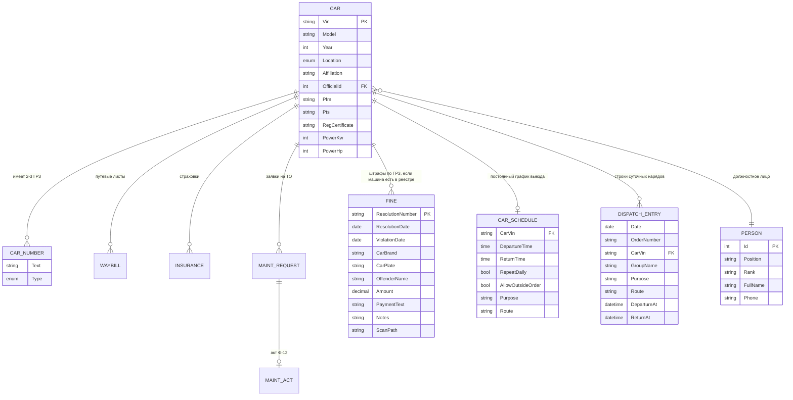
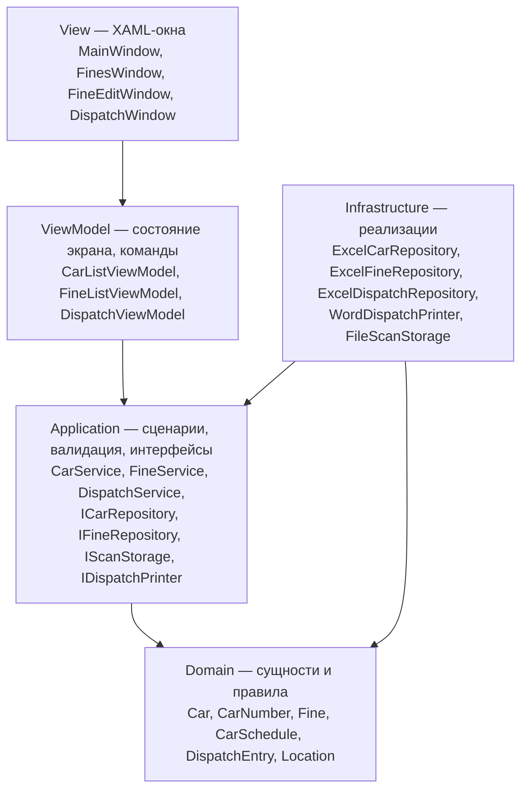

# ParkApp — дизайн-документ

**Версия:** 1.0
**Статус:** черновик к согласованию
**Основано на:** `docs/requirements/AutoPark.md` (исходные требования заказчика)

---

## 1. Назначение

ParkApp — настольное приложение для учёта автопарка воинской части / автохозяйства.
Заменяет ведение учёта в бумажных журналах и разрозненных Excel-файлах.

Приложение решает четыре задачи:

1. **Реестр техники** — единый список машин с документами и наработкой.
2. **Оперативный учёт** — путевые листы, наряды на выход техники, местонахождение.
3. **Сопровождение** — страховки (ОСАГО), заявки на ТО, акты Ф-12, штрафы.
4. **Архив сканов** — привязка PDF-сканов документов к записям и быстрое открытие.

### Границы (что НЕ входит)

- Бухгалтерия, зарплата, ГСМ-расчёты.
- Интеграция с ГИБДД/ФНС (штрафы вносятся вручную).
- Мобильный клиент.
- Разграничение прав доступа (в v1 приложение однопользовательское).

---

## 2. Пользователи и сценарии

| Роль | Кто это | Что делает в системе |
|---|---|---|
| Диспетчер | ведёт ежедневный учёт | путевые листы, наряд на выход, местонахождение машин |
| Техник / зампотех | отвечает за исправность | заявки на ТО, акты Ф-12, наработка |
| Делопроизводитель | ведёт документы | страховки, штрафы, сканы, отчёты |

Ключевые сценарии:

- **С1.** Найти машину по гос. номеру или VIN и увидеть все её документы и сканы.
- **С2.** Внести пришедшее постановление о штрафе, приложить скан, указать водителя.
- **С3.** Узнать, какие ОСАГО истекают в ближайшие 30 дней.
- **С4.** Сформировать наряд на выход техники на дату.
- **С5.** По заявке на ТО сгенерировать акт Ф-12 в Word.
- **С6.** Отчёт: сумма штрафов за период / по машине / по водителю.

---

## 3. Глоссарий

| Термин | Значение |
|---|---|
| **ГРЗ** | государственный регистрационный знак (гос. номер). У машины 2–3 знака: войсковой и гражданский |
| **VIN** | идентификационный номер кузова, 17 символов, бизнес-ключ машины |
| **ПТС** | паспорт транспортного средства |
| **СРТС / СТС** | свидетельство о регистрации ТС |
| **ПФМ** | номер по формуляру машины |
| **Наработка** | пробег в км (для колёсной) / моточасы (для спецтехники) |
| **Наряд на выход** | суточный документ со списком машин, которым разрешён выезд из парка |
| **Ф-12** | форма акта технического обслуживания |
| **Постановление** | документ о назначении административного штрафа, его номер — ключ штрафа |

---

## 4. Модель данных

### 4.1 Схема сущностей



### 4.2 Ключи: решение

Требования фиксируют «VIN (первичный ключ)». Принято следующее:

- **VIN — бизнес-ключ машины.** Уникален, обязателен, по нему идут все ссылки между таблицами v1.
- Поле `Guid Id` в `Car` **остаётся** (уже есть в коде), но используется только как технический идентификатор внутри процесса.
- **Внешние ключи ссылаются на VIN**, а не на `Guid Id`. Причина: `Id` не хранится в таблице и назначается заново при каждой загрузке, поэтому ссылаться на него нельзя. VIN стабилен и понятен человеку, открывшему файл в Excel.
- При переезде на СУБД (раздел 10) вводится суррогатный `int/Guid PK` + `UNIQUE (Vin)`, а FK переводятся на суррогат. Причина: VIN в реальности иногда правят из-за опечатки, а бизнес-ключ править дорого.

**Правило:** ссылки на машину везде называются `CarVin`, чтобы при миграции их было тривиально найти.

### 4.3 Сущности

#### Машина (`Car`)

Поля соответствуют рабочей таблице заказчика. **Почти всё необязательное**: у части машин данных нет, и строка с пропусками должна читаться, а не отбрасываться.

| Столбец в таблице | Поле | Тип | Примечание |
|---|---|---|---|
| № п/п | — | | порядковый номер, в модель не читается |
| Марка автомобиля | `Model` | string | |
| Гос. рег. знак | `Numbers` | List\<CarNumber\> | 2–3 знака; в одной ячейке разделяются `,` `;` `/` |
| Год выпуска | `Year` | int? | |
| **VIN** | `Vin` | string | **ключ машины**, обязателен |
| Модель и № двигателя | `EngineModel` | string | |
| Мощность двигателя КВт/Л.С. | `PowerKw`, `PowerHp` | int?, int? | «220/299» разбирается на два числа |
| № шасси (рама) | `Chassis` | string | |
| № кузова | `BodyNumber` | string | |
| ПФМ | `Pfm` | string | |
| ПТС | `Pts` | string | |
| Свид. о регистрации | `RegCertificate` | string | |
| Страховой полис | `InsurancePolicy` | string | номер из таблицы машин; отдельный учёт страховок — этап 4 |
| Диагностическая карта | `DiagnosticCard` | string | |
| Куда относится | `Affiliation` | string | значения из листа-справочника «Куда относится» |
| Местонахождение | `Location` | enum? | `Ppd` (ППД) / `Vo` (ВО) |
| Должностное лицо | `OfficialId` | int? | **FK на `Person.Id`** |
| Штатная | `IsStaff` | bool? | «вне штата» → false |
| Конфискат | `IsConfiscated` | bool | «да» или «конфискат» → true, пусто → false |
| Вместимость | `Capacity` | int? | человек |
| Тип машины | `VehicleType` | string | значения из листа-справочника «Тип машины» |
| Цвет | `Color` | string | |
| Объем двигателя | `EngineVolume` | int? | см³ |
| max m (масса) | `MaxMass` | decimal? | |
| m (масса) | `Mass` | decimal? | |
| Особые отметки | `Notes` | string | |
| ВАИ | `Vai` | string | |
| Получили машину | `ReceivedAt` | DateTime? | |
| Отдали машину | `HandedOverAt` | DateTime? | |

`CarNumber { Text, Type }`, `NumberType { Army, NoArmy }`. Тип знака в таблице отдельным столбцом не хранится: войсковым считается знак вида «4 цифры + 2 буквы» (0123АВ), остальные — гражданскими.

Мощность хранится **двумя числами**, а не строкой «220/299»: строка не сортируется и не фильтруется, а формат в файле фиксирован. На UI собирается обратно в «220/299».

«Куда относится» и «Тип машины» — закрытые списки, но **значения живут в данных, а не в коде**: заказчик ведёт их отдельными листами в том же файле машин (§6.5). Поэтому в модели это строки, а не C#-enum: добавить «спецтехнику» в список должно быть можно самому, без пересборки приложения. Приложение сверяет значения машин со списком и показывает несовпадения — так ловятся опечатки вроде «Гаражж».

#### Должностное лицо (`Person`)

Отдельная таблица, на которую ссылается машина.

| Столбец | Поле | Тип |
|---|---|---|
| № | `Id` | int — **ключ**, на него ссылается `Car.OfficialId` |
| Должность | `Position` | string |
| Звание | `Rank` | string |
| ФИО | `FullName` | string |
| Телефон | `Phone` | string |

Если столбца «№» в файле нет, номера назначаются по порядку строк — ссылка из машины всё равно попадёт в нужного человека.

#### Путевой лист (`Waybill`)

| Поле | Тип | Примечание |
|---|---|---|
| `Number` | string | номер путевого листа |
| `CarVin` | string FK | машина |
| `StartAt` | DateTime | дата+время начала |
| `EndAt` | DateTime? | дата+время конца, пусто = машина в рейсе |
| `OdometerStart` / `OdometerEnd` | int? | для автоподсчёта наработки |

Требования разделяют дату и время. В модели хранится **один `DateTime`**, а в UI это два контрола (`DatePicker` + маска времени) — так проще сравнивать интервалы и считать «машина в рейсе сейчас».

#### График машины (`CarSchedule`)

Постоянные настройки машины для наряда: приложение подставляет их само, а не спрашивает каждый день.

| Поле | Тип | Примечание |
|---|---|---|
| `CarVin` | string FK | ключ графика |
| `CarPlate` | string | подсказка человеку, открывшему файл в Excel |
| `DepartureTime` / `ReturnTime` | TimeSpan | «с 6 до 6», «с 5 до 5», «с 7 до 7», «с 6 до 22» |
| `RepeatDaily` | bool | «повторять» — машина попадает в наряд сама |
| `AllowOutsideOrder` | bool | машине положен блок разрешения сверху путевого листа |
| `GroupName` | string | группа, в которой машина идёт в наряде |
| `OperationGroup`, `Purpose`, `Route`, `Assignment`, `Notes` | string | значения по умолчанию для строки наряда |

**Время хранится как `TimeSpan`, дата подставляется при печати.** Машина ездит «с 6 до 6» вообще, а не «с 22.08 06:00 до 23.08 06:00» один раз: привязывать график к дате значило бы переписывать его каждый день.

**Возврат на следующий день выводится из времени, а не хранится галкой:**

```csharp
public bool ReturnsNextDay { get { return ReturnTime <= DepartureTime; } }
```

«с 6 до 6» — сутки (возврат завтра), «с 6 до 22» — тот же день. Отдельный флаг «суточная» рано или поздно разошёлся бы со временем.

#### Строка наряда (`DispatchEntry`)

Одна машина в наряде на одну дату.

| Поле | Тип | Примечание |
|---|---|---|
| `Date` | DateTime | дата наряда |
| `OrderNumber` | string | номер наряда, одинаков у всех строк дня |
| `CarVin` | string FK | |
| `CarBrand`, `CarPlate` | string | как печатается в наряде |
| `GroupName` | string | заголовок группы в таблице наряда |
| `OperationGroup` | string | группа эксплуатации («тр.») |
| `Purpose`, `Route`, `Assignment` | string | для каких целей, маршрут движения, в чьё распоряжение |
| `DepartureAt` / `ReturnAt` | DateTime | график, наложенный на дату наряда |
| `Notes` | string | |

**Наряд как документ отдельной сущностью не заводится.** Своих данных у него ровно два — дата и номер, и они повторяются в каждой строке. Плоская таблица «строка = машина в наряде» читается в Excel и фильтруется по дате без всякого кода; заголовочная сущность потребовала бы второго листа и связи между ними ради двух полей.

Прежняя модель (`DispatchOrder` со списком `AllowedCarVins`) отменена: наряд — не список VIN, у каждой машины в нём своя цель, свой маршрут и своё время.

#### Страховка (`Insurance`)

| Поле | Тип | Правило |
|---|---|---|
| `PolicyNumber` | string PK | уникален, вводится пользователем |
| `CarVin` | string FK | |
| `StartDate` / `EndDate` | DateTime | `EndDate > StartDate` |
| `ScanPath` | string | скан ОСАГО |

Производное: «истекает через N дней» — вычисляется, не хранится.

#### Заявка на ТО (`MaintenanceRequest`)

| Поле | Тип |
|---|---|
| `Number` | string PK |
| `Date` | DateTime |
| `CarVin` | string FK (модель и номер тянутся из машины) |
| `Odometer` | int — наработка на момент заявки, **вводит пользователь**: в таблице машин её нет |
| `OdometerSinceLastRepair` | int |
| `LastRepairDate` | DateTime? |
| `ServiceKinds` | List\<string\> (вид ТО — что обслужить) |
| `ScanPath` | string |

#### Акт ТО Ф-12 (`MaintenanceAct`)

Отдельная сущность-надстройка над заявкой; почти всё вычисляемое:

| Поле | Источник |
|---|---|
| `RequestNumber` | FK на заявку |
| данные машины | из `Car` |
| текущая наработка | из заявки (её ввёл пользователь) |
| макс. наработка | **формула, см. открытый вопрос О-2** |
| остаток наработки | макс. − текущая |
| текст акта | генерируется из `ServiceKinds` заявки по шаблону |
| `DocxPath` | сгенерированный .docx |

#### Штраф (`Fine`) — книга постановлений

Поля повторяют **реальную книгу**, которую ведут в Excel. Из этого следуют три решения, отличные от первоначальной модели:

| Столбец книги | Поле | Тип | Примечание |
|---|---|---|---|
| № п/п | `RowNumber` | int? | у новых записей проставляется при сохранении |
| Дата правонарушения, Ф.И.О. правонарушителя | `ViolationDate` + `OffenderName` | DateTime + string | **два значения в одной ячейке**, разбираются при чтении |
| Марка АТ | `CarBrand` | string | |
| ГРЗ | `CarPlate` | string | **связь с реестром машин идёт по нему**, не по VIN |
| Дата привлечения | `ResolutionDate` | DateTime | |
| **Номер постановления** | `ResolutionNumber` | string | **ключ записи** |
| Сумма штрафа | `Amount` | decimal | |
| оплата, чек, дата | `PaymentText` | string | свободный текст, хранится целиком |
| — | `PaidDate`, `PaymentReference` | DateTime?, string | разбираются из `PaymentText` |
| — | `IsPaid` | bool | вычисляется: графа оплаты заполнена |
| Примечание | `Notes` | string | |
| Скан постановления | `ScanPath` | string | **столбец приложения**, в книге его нет — добавляется в конец |

**Машина — текст, а не ссылка.** В книгу пишут то, что напечатано в постановлении, и машины может не оказаться в реестре. Реестр используется как подсказка: по ГРЗ подтягивается карточка машины, в списке видно «нет в реестре». Кнопка «Подставить» заполняет марку и ГРЗ из карточки, но не запрещает вписать своё.

**Правонарушитель — строка ФИО, а не ссылка на справочник людей.** Причина та же: в книге это текст, и нарушитель не обязательно числится в справочнике. Ранее принятое решение (О-3) отменено реальными данными.

**Оплата — свободный текст.** «Оплата 19.05.2026 ИД платежа 952951978536EGLG». Из него вытаскиваются дата и идентификатор платежа — чтобы отбирать неоплаченные и считать долг, — но **исходная строка сохраняется**. Пока пользователь не менял оплату в приложении, в книгу возвращается его собственная формулировка; шаблон применяется только к тому, что он сам отредактировал.

**Места нарушения в книге нет** — поле убрано из модели. Если оно понадобится, вернуть его можно только вместе со столбцом в книге.

#### Вложение (`Attachment`)

| Поле | Тип |
|---|---|
| `RelativePath` | string (относительно корня данных) |
| `OriginalFileName` | string |
| `AttachedAt` | DateTime |
| `Kind` | enum (СРТС, ОСАГО, Постановление, Заявка на ТО, Акт Ф-12) |

Для штрафа в прототипе используется упрощение — одно поле `ScanPath` вместо коллекции, поскольку постановление всегда одно.

---

## 5. Архитектура

### 5.1 Слои

Проект уже разложен по слоям, дизайн эту раскладку закрепляет:



Правила зависимостей:

1. `Domain` не зависит ни от чего (ни от WPF, ни от Newtonsoft).
2. `Application` зависит только от `Domain`, объявляет интерфейсы репозиториев и хранилищ.
3. `Infrastructure` реализует интерфейсы `Application`. Только здесь есть File IO, JSON, `Process.Start`.
4. `ViewModel` не знает про JSON и про файлы; работает через сервисы и интерфейсы диалогов.
5. `View` содержит только разметку и минимальный code-behind (`InitializeComponent`, проброс `RequestClose`).

Слои живут в одной сборке, разделены неймспейсами `ParkApp.components.*`. Выделять их в отдельные проекты на текущем масштабе не нужно; при росте — раздел 10.

### 5.2 Композиционный корень

`AppServices` — статический реестр, создаваемый один раз в `App.OnStartup`. Это «DI для бедных»: полноценный контейнер (Autofac/DryIoc) на 6 сервисов не окупается, но точка сборки одна, и её замена на контейнер — правка одного файла.

### 5.3 Асинхронность

Все обращения к репозиториям — `async Task`. Сейчас за ними синхронный File IO, и это осознанно: файлы маленькие, а сигнатуры уже готовы к переезду на сеть/СУБД, где асинхронность обязательна.

Замечание к текущему коду: в `JsonCarRepository.SaveAsync` стоит `async` без `await` (предупреждение CS1998) — метод выполняется синхронно. В новых репозиториях этого нет: они возвращают `Task.FromResult` / `Task.CompletedTask` явно.

---

### 5.4 Соединение таблиц: почему пока не нужна БД

Главный довод за базу данных обычно звучит как «иначе неудобно соединять таблицы». Для нашего объёма это не так: соединение в коде выходит короче SQL и уже работает в приложении — в списке машин подтягивается должностное лицо, в списке штрафов — марка и гос. номера.

**Решение: база данных не нужна.** Заказчик подтвердил, что работает один человек, каждый со своими документами; одновременной записи в один файл не будет. Критерии, при которых решение придётся пересмотреть, — ниже.

Данные каждой таблицы читаются в память списком, а связь делается словарём по ключу:

```csharp
// машины один раз укладываются в словарь по VIN
var carsByVin = cars.ToDictionary(car => car.Vin, StringComparer.OrdinalIgnoreCase);

// дальше каждый штраф находит свою машину за одно обращение
Car car;
carsByVin.TryGetValue(fine.CarVin, out car);
```

Это ровно то, что делает `FineListViewModel`, чтобы показать модель и гос. номера рядом со штрафом. Многотабличные выборки пишутся так же:

```csharp
// штрафы за квартал по машинам гаража, с суммой на машину
var report = fines
    .Where(f => f.ViolationDate >= from && f.ViolationDate <= to)
    .Join(cars, f => f.CarVin, c => c.Vin, (f, c) => new { Fine = f, Car = c })
    .Where(x => x.Car.Affiliation == Affiliation.Garage)
    .GroupBy(x => x.Car.Vin)
    .Select(g => new { Vin = g.Key, Total = g.Sum(x => x.Fine.Amount) });
```

LINQ здесь заменяет `JOIN`, `WHERE`, `GROUP BY` и `SUM`, но с проверкой типов на этапе компиляции — опечатка в имени поля не доживёт до запуска, в отличие от строки с SQL.

**Цена.** 500 машин и 10 000 штрафов — это меньше 5 МБ в памяти и миллисекунды на словарь. Файлы читаются целиком при каждом обращении к репозиторию; на таком объёме это незаметно, а если станет заметно — данные кэшируются в памяти на время работы приложения, и это правка одного класса.

**Когда база станет обязательной.** Не «когда станет много таблиц», а когда наступит хотя бы одно из:

| Признак | Почему файлы перестают работать |
|---|---|
| **Двое одновременно правят одну таблицу** | оба сохранили — правки первого стёрты; блокировок у файла нет. Пока каждый ведёт свои документы, этого не происходит |
| Десятки тысяч записей в таблице | чтение целиком на каждое обращение становится заметным |
| Нужна история изменений («кто и когда исправил») | по файлу этого не восстановить |
| Нужны права доступа по ролям | файл либо доступен целиком, либо нет |

Первый пункт — единственный вероятный в этом проекте, и он совпадает с пожеланием «в будущем — сервер и несколько компьютеров» из требований. То есть переход на БД привязан не к сложности запросов, а к тому, что двое начнут править одну и ту же таблицу (раздел 10).

**Что делать до этого.** Справочники (машины, люди) вынести в общую папку через `SharedRoot` — их приложение только читает, поэтому несколько ПК не мешают друг другу и копии не расходятся. Документы (штрафы, путевые листы) остаются локальными у того, кто их ведёт.

---

## 6. Хранение данных

Данные лежат в Excel-таблицах — в том же виде, в котором учёт ведётся сейчас. Файл остаётся читаемым и правимым в Excel без приложения, и это осознанное требование заказчика, а не временное решение.

### 6.1 Раскладка файлов

```
<SharedRoot>/                 общие справочники, одинаковы у всех
├── Машины/
│   ├── Машины.xlsx          реестр техники
│   └── Сканы/               СРТС, ПТС
└── Люди/
    └── Люди.xlsx            должностные лица

<DataRoot>/                   свои документы, у каждого рабочего места свои
├── Штрафы/
│   ├── Штрафы.xlsx
│   └── Сканы/               постановления
│       └── 18810516250401234567.pdf
├── Наряды/
│   ├── Наряды.xlsx          наряды, графики машин, реквизиты для печати
│   └── Документы/           напечатанные наряды и путевые листы (.docx)
├── Страховки/               (этап 4)
└── ТО/                      (этап 6)

<папка приложения>/
├── ParkApp.exe
├── Настройки.xml            пути, имена листов, включённые разделы
└── Templates/               шаблоны печатных форм .docx
```

Шаблоны лежат **рядом с приложением, а не в данных**: это часть поставки, одинаковая у всех рабочих мест, и обновляется она вместе с программой.

Пути настраиваются **в самом приложении** (Настройки → «Где лежат данные»): две папки — своя и общая — и, если нужно, каждый файл по отдельности. Порядок разрешения пути: настройки → `App.config` → значение по умолчанию. Настройки читаются при каждом обращении, поэтому смена папки действует сразу, без перезапуска.

Сами настройки лежат в «Настройки.xml» **рядом с приложением**, а не в папке данных: в них записан путь к этой самой папке, и класть их внутрь неё — замкнутый круг.

**Зачем два корня.** Рабочих мест несколько, но каждый ведёт только свои документы: один — штрафы, другой — путевые листы. Справочники же (машины, люди) одинаковы у всех. Их можно либо копировать на каждое место, либо положить в общую папку и указать её в `SharedRoot` — приложение эти таблицы **только читает**, а параллельное чтение одного файла безопасно и не требует БД. Второй вариант избавляет от рассылки копий и расхождения данных.

В таблице хранится **относительный** путь скана (`Штрафы\Сканы\188105….pdf`): абсолютный сломается при переносе папки на другой ПК или на шару.

### 6.2 Чем читаем и пишем xlsx

Формат `.xlsx` — это zip с несколькими XML внутри. В проекте своя минимальная реализация (`components/Infrastructure/Excel/`), без внешних библиотек:

| Вариант | Почему не выбран |
|---|---|
| ClosedXML, NPOI, EPPlus | проект на `packages.config`, где каждую транзитивную зависимость нужно вручную прописывать в `.csproj` — для плоской таблицы «шапка + строки» это дороже своей реализации |
| Excel Interop | требует установленного Excel на каждом ПК |
| OleDb (драйвер ACE) | требует отдельной установки драйвера, разрядность конфликтует с приложением |

Своя реализация покрывает ровно то, что нужно: чтение листа по имени (включая `sharedStrings` и файлы, сделанные Excel) и запись плоской таблицы с датами, деньгами и закреплённой шапкой. Если понадобится больше — формулы, несколько листов, оформление — `XlsxReader`/`XlsxWriter` меняются на библиотеку, остальной код не трогается.

Ограничение: читается только `.xlsx`. Старый `.xls` нужно один раз пересохранить в Excel («Сохранить как» → «Книга Excel»). Приложение говорит об этом прямым сообщением, а не «файл повреждён».

### 6.3 Работа с чужой книгой

Книга постановлений ведётся людьми и до приложения, и рядом с ним. Отсюда три правила записи:

1. **Порядок строк сохраняется**, новые дописываются в конец. Это журнал, а не отсортированный список.
2. **Чужая нумерация не переписывается**: «№ п/п» у существующих строк остаётся как есть, новым присваивается следующий номер.
3. **Столбцы, которых приложение не знает, возвращаются на место вместе с типом и оформлением ячейки.** Без этого перезапись превратила бы дату в чужом столбце в число вида «46064»: приложение читает значения строками и само по себе не знает, что ячейка была датой. Поэтому при чтении сохраняются исходный тип и индекс стиля каждой ячейки.

Строки без номера постановления (разделители, итоги) при перезаписи теряются — ключа у них нет, сопоставить их не с чем.

### 6.4 Правила записи

Excel-файл как хранилище требует аккуратности при сохранении:

- **Запись атомарная.** Сначала пишется `Штрафы.xlsx.tmp`, потом одним движением подменяет основной файл. Обрыв на середине не оставит битую таблицу.
- **Предыдущая версия сохраняется** рядом как `Штрафы.xlsx.bak` — дешёвая страховка от испорченной правки.
- **Файл открыт в Excel** — запись невозможна, пользователь получает понятное сообщение «закройте файл и повторите», а не системную ошибку доступа.
- **Чтение не мешает Excel**: файл открывается в режиме, допускающем параллельное чтение.
- Таблица перезаписывается целиком. На тысячах строк это доли секунды, а частичная правка xlsx потребовала бы полноценной библиотеки.

### 6.5 Чтение таблицы, которую ведут люди

Столбцы ищутся **по названиям, а не по номерам**: в живых таблицах столбцы переставляют и переименовывают. Сравнение не различает регистр, пробелы, точки, «№» и ё/е, поддерживаются синонимы («Модель» = «Марка» = «Марка/модель»).

Что приложение делает с типичными особенностями рабочих файлов:

| Что в файле | Как читается |
|---|---|
| Посторонний первый лист («Инструкция») | лист выбирается по имени — «Машины», «Штрафы» |
| Пустые строки до шапки и внутри таблицы | пропускаются, шапка ищется как первая непустая строка |
| Несколько номеров в одной ячейке | разбиваются по `,` `;` `/` и переводу строки |
| Отдельные столбцы «Гос. номер 1», «Гос. номер 2» | собираются вместе |
| Тип знака не указан | войсковой определяется по формату «4 цифры + 2 буквы», иначе гражданский |
| «2010 г.», «12 500 км» | вытаскивается число |
| «1 500,50 руб.» | читается как 1500.50 |
| Дата числом (Excel хранит их так) или текстом | оба варианта распознаются |
| VIN строчными буквами, с пробелами | приводится к верхнему регистру |
| VIN с кириллическими А, В, Е, К, М, Н, О, Р, С, Т, Х | буквы заменяются на латинские двойники — иначе одна машина задвоится |
| Строка без VIN / без номера постановления | пропускается: без ключа запись не с чем связать |
| Лишние столбцы (ПТС, ПФМ, мощность) | не мешают — просто не читаются |

**Файл «Машины.xlsx» пока только читается.** Причина: карточки машины в приложении ещё нет (этап 1), а перезапись файла целиком потеряла бы столбцы, которые приложение не знает. Запись появится вместе с редактором машины, и тогда неизвестные столбцы должны сохраняться как есть.

Если файла нет, приложение создаёт образец с тремя демо-машинами — чтобы запуститься на чистом ПК. Реальную таблицу достаточно положить на его место.

### 6.6 Справочные списки в файле машин

Файл «Машины.xlsx» содержит не один лист, а несколько:

| Лист | Содержимое |
|---|---|
| **Машины** | сама таблица техники |
| **Куда относится** | список значений: столбец `A`, в `A1` — «Название», ниже значения |
| **Тип машины** | то же для типов |

Списки читаются строго по имени листа: подставить вместо справочника первый попавшийся лист нельзя, иначе в «Тип машины» попали бы марки автомобилей.

Что это даёт:

- **закрытый список без перекомпиляции** — новое значение добавляется строкой в Excel;
- **проверка при чтении** — значение машины, которого нет в списке, выводится предупреждением в главном окне с указанием VIN. Глазами в таблице на 200 строк такую опечатку не найти;
- если листа нет или он пуст, проверка просто не выполняется — приложение работает и с урезанным файлом.

Тем же способом позже добавляются другие списки (виды ТО, цвета) — нужен лист и одно значение в перечислении `LookupList`.

### 6.7 Целостность

Внешних ключей в Excel нет, поэтому целостность держится на уровне `Application`:

- ГРЗ из книги может не найтись в реестре машин — в списке это видно как «нет в реестре», запись при этом остаётся рабочей;
- при появлении редактора машин удаление машины со связанными штрафами будет запрещено;
- дубли VIN внутри файла: используется первая строка, остальные игнорируются.

### 6.8 Конкурентный доступ

В v1 его нет — один процесс, один пользователь. Одновременная работа двух ПК с одним файлом приведёт к потере правок: у файла нет ни блокировок, ни транзакций. Это главный и, по сути, единственный настоящий повод перейти на БД — критерии в §5.4.

---

## 7. Подсистема сканов

Требование: «отсканить и занести в приложение через "вложить", оно само сохранит в нужную папку; при открытии информации машины — ссылки на PDF; при открытии штрафа — ссылка на постановление».

Интерфейс (`Application`):

```csharp
public interface IScanStorage
{
    string Attach(string category, string entityKey, string sourceFilePath); // → относительный путь
    string GetFullPath(string relativePath);
    bool Exists(string relativePath);
    void Open(string relativePath);   // открыть системным просмотрщиком
    void Delete(string relativePath);
}
```

Реализация `FileScanStorage` (`Infrastructure`) складывает файл в `Scans/<category>/<ключ>.<ext>`.

Что осознанно **не** делается в v1:

- Прямое управление сканером (TWAIN/WIA). Пользователь сканирует штатной программой МФУ в файл, приложение его «вкладывает». Драйверная работа с TWAIN из .NET дорога и хрупка, а выигрыш — один шаг в сценарии.
- Хранение бинарников внутри JSON (base64) — файл раздувается, поиск и бэкап усложняются.

---

## 8. Генерация документов

Печатные формы делаются **шаблоном .docx с плейсхолдерами**, а не построением документа кодом. Причина простая: форму правит заказчик — двигает поля, меняет подписантов, — и делать это он должен в Word, без пересборки приложения.

Шаблоны лежат в `Templates` рядом с приложением и копируются в выходной каталог при сборке.

| Шаблон | Что печатает |
|---|---|
| `Наряд.docx` | наряд на выход техники на дату |
| `Путевой лист.docx` | лицевые стороны путевых листов, страница на машину |
| `Путевой лист (оборот).docx` | обороты, столько же страниц |
| `F12.docx` | акт технического обслуживания (этап 6) |

### 8.1 Чем заполняем

`Xceed.Words.NET` (DocX) остался в `packages.config` от первой версии проекта, но **не используется**. Его `ReplaceText` меняет текст и только текст, а формам нужно ещё две вещи: размножить строку таблицы (машин в наряде столько, сколько выбрали) и вырезать кусок документа целиком (блок разрешения печатается не на каждом листе). Вместо него — свой `WordTemplate` (`Infrastructure/Word/`), устроенный так же, как `XlsxReader` для таблиц: zip + `XDocument`, без внешних библиотек.

| Операция | Зачем |
|---|---|
| `Fill` — замена `{{ИМЯ}}` на значение | шапка, даты, подписанты |
| `ExpandRows` — размножение строки таблицы по образцу | строки машин и заголовки групп в наряде |
| `KeepBlock` — оставить или вырезать всё между `{{#ИМЯ}}` и `{{/ИМЯ}}` | блок разрешения на путевом листе |
| `SavePages` — сборка многостраничного документа из шаблона-страницы | пачка путевых листов одним файлом, а не двадцатью |

**Плейсхолдер в файле разрезан на части.** Word хранит абзац последовательностью «run»-ов, и `{{МАРКА}}` почти всегда лежит в трёх-четырёх из них — достаточно, чтобы кто-то однажды поправил в шаблоне одну букву. Поэтому замена идёт по склеенному тексту абзаца, а результат кладётся в первый run абзаца; иначе половина плейсхолдеров просто не находилась бы.

**Блок может занимать несколько абзацев.** `{{#РАЗРЕШЕНИЕ}} … {{/РАЗРЕШЕНИЕ}}` в путевом листе — это пять отдельных абзацев (заголовок, срок, должность, звание и Ф.И.О. подписавшего). Поэтому вырезание работает по списку абзацев страницы, а не внутри одного: иначе от вырезанного блока оставались бы четыре пустые строки над формой.

### 8.2 Контракт шаблона

| Разметка | Смысл |
|---|---|
| `{{ИМЯ}}` | значение |
| `{{ГРУППА}}` | строка-образец заголовка группы в таблице наряда |
| `{{МАРКА}}`, `{{ГРЗ}}`, `{{ЦЕЛЬ}}`, … | строка-образец машины в таблице наряда |
| `{{#ИМЯ}} … {{/ИМЯ}}` | блок, который может быть вырезан целиком |

Строки-образцы после размножения удаляются, а плейсхолдеры, которым не нашлось значения, вычищаются: в готовом документе фигурных скобок не остаётся — пустое поле лучше, чем `{{ГРУЗ}}` в подписанной бумаге.

Даты печатаются прописью — «22» августа 2026 г. — через свою таблицу месяцев (`RussianDate`), а не через культуру ОС: падеж месяца в .NET зависит от формата и настроек рабочего места, а форма документа требует родительного всегда.

### 8.3 Реквизиты для печати

Наименование части и подписанты (согласовал, утвердил, подписал, инструктаж, ответственный, разрешил) не зашиты в шаблоны и не спрашиваются при печати: они лежат на листе «Реквизиты» файла нарядов в виде «Параметр / Значение» и правятся в Excel. Их около двадцати, меняются они раз в год — отдельное окно настроек под это не окупается. При первом запуске лист создаётся с пустыми значениями и названиями параметров по-русски.

---

## 9. Пользовательский интерфейс

Требование: «окна для редактирования каждой таблицы с выбором машины, если это не редактор машины».

Отсюда единый паттерн для всех справочников — **окно-список + окно-редактор**:

```
MainWindow
├── ToolBar: кнопки только включённых разделов + [Настройки]
├── Плашки ошибок и предупреждений (значения вне справочных списков)
└── Список машин с ответственным из справочника людей

<Сущность>Window  (список)
├── ToolBar: Добавить / Изменить / Удалить / Открыть скан / Обновить
├── Панель фильтров (машина, период, текстовый поиск)
├── ListView с колонками
└── StatusBar: количество записей, итоговая сумма

<Сущность>EditWindow  (модальный редактор)
├── Поля формы
├── Выбор машины (ComboBox: модель + ГРЗ + VIN)
├── [Вложить скан] [Открыть] [Удалить]
├── Блок ошибок валидации
└── [Сохранить] [Отмена]
```

Единообразие даёт переиспользование: `RelayCommand`, `ViewModelBase`, `IDialogService`, панель ошибок и стиль окна-списка пишутся один раз, каждый следующий справочник — это в основном XAML и поля VM.

**Пути к данным задаются в настройках.** Кнопка «Обзор…» открывает выбор папки или файла; путь можно и вписать руками, например сетевой `\\server\ParkApp`. Пустое поле означает «путь по умолчанию», он показан серым рядом с полем.

**Имена листов тоже настраиваются.** Лист в файле может называться как угодно — приложение не навязывает своё имя. Настраиваются листы машин, людей, штрафов и два справочных («Куда относится», «Тип машины»). Выбор хранится вместе с остальными настройками.

**Выбранный файл проверяется сразу.** Пользователь должен узнать «это не тот файл» при выборе, а не при следующем открытии окна. Проверяются: расширение `.xlsx`, наличие листа с ожидаемым именем и обязательного столбца-ключа (`VIN`, `ФИО`, `№ постановления`).

Два исхода различаются, потому что чинятся по-разному:

| Что не так | Что делает приложение |
|---|---|
| **Листа с таким именем нет** — файл, возможно, тот, просто лист назван иначе | предлагает выбрать лист: показывает список листов книги и позволяет вписать имя вручную. Выбранное имя сохраняется в настройках |
| **Файл не тот** — не `.xlsx`, не читается, нет столбца-ключа | предупреждение с причиной и **повторный запрос файла**, пока файл не подойдёт или пользователь не откажется |

Путь и имя листа, вписанные руками, проверяются при сохранении: непригодный файл не даст закрыть окно.

Отдельно показываются **необязательные столбцы, которых в файле нет** — это не мешает работать, но предупреждает, что часть данных читаться не будет.

Имена столбцов для проверки берутся из тех же констант, по которым файл потом читается (`ExcelCarRepository.VinNames` и т.п.), поэтому проверка не может разойтись с чтением.

**Если файл переместили.** Приложение не пытается «починить» ситуацию само:

- путь **задан пользователем**, а файла нет → ошибка с полным путём и подсказкой проверить настройки. Создать вместо пропавшего файла образец было бы хуже всего: человек увидел бы три демо-машины вместо своих двухсот и решил, что данные потеряны;
- путь **по умолчанию**, файла нет → это первый запуск, создаётся файл-образец;
- файл на месте, но листа нет → ошибка с именем листа и предложением указать его в настройках.

Ошибка показывается плашкой в главном окне, рядом на панели — кнопка «Настройки». После исправления пути данные перечитываются без перезапуска.

**Состав панели разделов настраивается пользователем.** Каждый ведёт свой вид документов, и чужие кнопки только мешают: в окне «Настройки» отмечаются нужные разделы, выбор сохраняется в «Настройки.xml» рядом со своими документами. Нереализованные разделы там же видны, но выключены с пометкой «в разработке» — это заодно показывает план работ.

Перечень разделов лежит в одном месте (`SectionCatalog`): новый раздел добавляется одной записью и сразу появляется и в настройках, и на панели.

**Наряд на выход — таблица, а не пара «список + редактор».** Здесь записи не заводят по одной: раз в день человек просматривает весь парк, отмечает галочками, кто едет, правит время двум-трём машинам и печатает. Поэтому окно — одна таблица со всеми машинами, редактируемая прямо в строке:

```
DispatchWindow
├── Панель: дата (по умолчанию завтра) · номер наряда ·
│           [Отметить повторяющиеся] [Снять все] [Обновить]
├── DataGrid: [✓ В наряд] Марка · Г.Р.З. · Группа · Гр. эксп. · Для каких целей ·
│             Маршрут · В чьё распоряжение · Выезд · Возврат · Возвращение ·
│             [✓ Повторять] [✓ Вне наряда] · Примечание
└── Панель: [Сохранить] [Печать наряда] [Путевые листы] [Путевой лист вне наряда]
```

Решения, заложенные в это окно:

- **дата по умолчанию — завтра**: наряд составляют накануне. Другую дату можно выбрать тут же, список и отметки перечитываются под неё;
- **«повторять» действует только на новый наряд.** Машина с этой отметкой попадает в наряд сама. Но если наряд на дату уже сохранён и машину из него сняли, при повторном открытии она не вернётся: сохранённый документ важнее правила;
- **время вводится как удобно** — «6», «6:00», «06.00». Выезд и возврат пересчитываются при смене даты, сутки «с 6 до 6» сами переносят возврат на следующий день, и в таблице это видно колонкой «Возвращение»;
- **правки в строке возвращаются в график машины.** Изменили время, цель или маршрут — они сохранятся и подставятся завтра. Это и есть требование «график сохраняется для машин»; ради разовой поездки график можно не портить, сняв «повторять»;
- **номер наряда предлагается сам** — следующий за наибольшим числовым номером за два предыдущих месяца, но поле остаётся текстовым: номера бывают с буквами;
- **путевой лист вне наряда** печатается отдельной кнопкой и только для машин с отметкой «вне наряда» — ночной или внезапный выезд, когда вчера в наряд не добавляли.

Валидация показывается **списком ошибок в окне редактора при сохранении**, а не всплывающими `MessageBox` на каждое поле: правила часто межполевые (`ViolationDate ≤ ResolutionDate`), и проверять их поштучно нельзя.

---

## 10. Переход на сервер («В будущем»)

Требование: хранить данные не на локальном ПК, а на сервере, с несколькими подключёнными компьютерами.

Рекомендуемый целевой вариант — **PostgreSQL/SQL Server + Entity Framework, клиент ходит в БД напрямую** (без промежуточного API). Для локальной сети на 3–10 рабочих мест это самый дешёвый путь: приложение уже разделено на слои, меняется только `Infrastructure`.

Что меняется:

**Когда переходить — в §5.4.** Коротко: не из-за сложности запросов (соединение таблиц в коде уже работает), а из-за второго одновременного пользователя.

| Компонент | Сейчас | После |
|---|---|---|
| `ICarRepository`, `IFineRepository` | `ExcelCarRepository`, `ExcelFineRepository` | `EfCarRepository`, `EfFineRepository` |
| Ключи | VIN как бизнес-ключ | суррогатный PK + `UNIQUE(Vin)` |
| Сканы | папки `<Раздел>\Сканы` | сетевая шара (реализация `IScanStorage`), путь остаётся относительным |
| Конкуренция | нет | оптимистичная блокировка (`rowversion`), транзакции |
| Настройки | `DataRoot` в `App.config` | строка подключения в `App.config` |

`Domain`, `Application`, `ViewModel`, `View` не меняются — это и есть главная выгода от текущей раскладки по слоям. Замена хранилища — две строки в `AppServices.Initialize`.

Промежуточный REST API имеет смысл добавлять только если появятся клиенты вне локальной сети или потребуется разграничение прав.

Миграция данных: разовая утилита читает таблицы существующим `XlsxReader` и заливает в БД; сканы копируются в шару с сохранением относительных путей. Выгрузка обратно в Excel останется как отчёт — привычка работать с таблицей никуда не денется.

---

## 11. Нефункциональные требования

| Параметр | Значение |
|---|---|
| Платформа | **Windows 7 SP1 и новее, .NET Framework 4.8, WPF.** Ограничение жёсткое: парк рабочих мест на Windows 7, а .NET 5/6/8 на неё не ставится. Любая библиотека выбирается с поддержкой `net48`; переводить проект на .NET Core/5+ нельзя |
| Объём данных | до ~500 машин, до ~10 000 штрафов/путевых листов |
| Отклик UI | список открывается < 1 с на указанном объёме |
| Локализация | только русский |
| Рабочие места | несколько ПК, но каждый ведёт свой вид документов; справочники общие только на чтение. Одновременной записи в одну таблицу нет |
| Права | разграничения нет и не требуется: у каждого свои файлы документов |
| Бэкап | ручное копирование каталога данных; после переезда — средствами СУБД |

---

## 12. Технический долг текущего кода

Найдено при исследовании, к исправлению на этапах 0–1:

1. `JsonCarRepository` больше не используется (машины читаются из Excel), но остаётся в проекте. Удалить на этапе 1 вместе с зависимостью от `Newtonsoft.Json`, если она больше нигде не нужна. В нём же два дефекта, которые не стоит повторять: `SaveAsync` помечен `async` без `await` (CS1998), а `JsonConvert.DeserializeObject` может вернуть `null` на пустом файле.
2. `CarService.GetByLocationAsync` реализован, но нигде не вызывается — нет фильтра по местонахождению в UI.
3. `CarListViewModel.Load()` — `async void` без обработки исключений: ошибка чтения файла уронит приложение молча. В новых ViewModel это закрыто try/catch, старую нужно поправить.
4. Машины пока только читаются из Excel: редактор машины и запись с сохранением неизвестных столбцов — этап 1.
5. Приложение не логирует ошибки в файл: если что-то упало у пользователя, разбираться не по чему.
6. Проект в старом формате csproj: каждый новый файл нужно вручную регистрировать в `.csproj`.
7. `Xceed.Words.NET` (DocX) остался в `packages.config`, но не используется — документы заполняет свой `WordTemplate` (§8.1). Удалить пакет вместе с `JsonCarRepository`, если он больше нигде не понадобится.
8. **Проект ни разу не собирался**: среды с .NET Framework 4.8 под рукой нет. Логика xlsx и docx проверена отдельно — сгенерированные файлы читаются сторонними разборщиками, — но компилятор код не видел. Первое, что нужно сделать на машине с Visual Studio, — собрать решение и пройти по ошибкам.

---

## 13. Вопросы

### Закрыты (ответы получены)

| № | Вопрос | Ответ |
|---|---|---|
| **О-1** | «Местонахождение №1 / №2» | **ППД и ВО.** Enum `Location { Ppd, Vo }`, значения `Park`/`SVO` из первой версии переименованы |
| **О-7** | Названия столбцов в файле машин | получена полная шапка из 29 столбцов; сопоставление проверено на ней целиком |
| **О-10** | Сколько человек работает одновременно | **один**; каждый ведёт только свои документы → БД не нужна (§5.4) |
| **О-5**, **О-11** | Значения «Куда относится» и «Тип машины» | ведутся **листами в файле машин**: столбец `A`, в `A1` «Название». Список правится в Excel, приложение сверяет с ним данные (§6.5) |
| **О-12** | Скрывать ли неиспользуемые разделы | да, **выбором пользователя в настройках**; сохраняется в «Настройки.xml» |
| **О-3** | Водитель — строка или справочник | сначала решили «справочник», но **реальная книга показала иначе**: «Ф.И.О. правонарушителя» пишут текстом в одну ячейку с датой. В модели строка |
| **О-8** | Формат файлов | **.xlsx**; поддержка старого `.xls` не нужна |
| **О-4** | Статус оплаты штрафа | в книге это графа «оплата, чек, дата» свободным текстом; дата и ИД платежа разбираются из неё, заполненная графа означает «оплачен» |
| книга | Как выглядит книга постановлений | получен образец: 9 столбцов, машина маркой и ГРЗ, оплата текстом. Модель приведена к нему |
| **О-6** | Водитель в путевом листе | один, но **вписывает его не приложение** — поля в модели нет |
| наработка | Откуда брать наработку для Ф-12 и заявок | **вводит пользователь** в самой заявке; в таблице машин её нет и хранить не нужно |
| наряд | Как машина попадает на выезд | наряд на дату + путевой лист на каждую машину наряда; получены три реальные формы, они стали шаблонами |
| **О-13** | Время выезда машин | у каждой машины своё («с 6 до 6», «с 5 до 5», «с 7 до 7», «с 6 до 22»); хранится графиком машины и подставляется само |
| **О-14** | Формулировка разрешения на путевом листе | машина в наряде — «Использование машины … разрешаю»; иначе — «Использование машины вне наряда … разрешаю» |
| **О-15** | На какую дату печатать путевой лист | по умолчанию **на завтра**, с возможностью выбрать другую дату |

### Открыты

| № | Вопрос | Почему важно | Предложение |
|---|---|---|---|
| **О-2** | Формула макс. наработки для акта Ф-12 | без неё акт не сгенерировать | нужен норматив от заказчика (км/моточасы по модели?) |
| **О-9** | Машины и людей правят в Excel или нужен редактор в приложении? | определяет, писать ли в эти файлы и сохранять ли неизвестные столбцы | предложено: этап 1 добавляет редактор, сохраняющий все столбцы |

---

## 14. Прототип «Штрафы»

Реализован в этой итерации как эталон для остальных справочников: следующий справочник делается копированием этой пятёрки файлов с заменой сущности.

### Состав

| Слой | Файлы |
|---|---|
| Domain | `Fine.cs`, `Person.cs` |
| Application | `IFineRepository.cs`, `FineService.cs`, `FineFilter.cs`, `IScanStorage.cs`, `IFileDialogService.cs` |
| Application | `ScanCategory.cs`, `IPersonRepository.cs`, `PersonService.cs`, `ILookupRepository.cs`, `LookupService.cs`, `LookupList.cs`, `AppSection.cs`, `IAppSettings.cs` |
| Infrastructure | `ExcelFineRepository.cs`, `ExcelCarRepository.cs`, `ExcelPersonRepository.cs`, `ExcelLookupRepository.cs`, `XmlAppSettings.cs`, `FileScanStorage.cs`, `WpfFileDialogService.cs`, `AppPaths.cs` |
| Infrastructure/Excel | `XlsxReader.cs`, `XlsxWriter.cs`, `XlsxCell.cs`, `XlsxSheet.cs`, `SheetTable.cs` — чтение и запись .xlsx (в т.ч. нескольких листов) без внешних библиотек |
| ViewModel | `MainViewModel.cs`, `SettingsViewModel.cs`, `FineListViewModel.cs`, `FineEditViewModel.cs`, `FineRowViewModel.cs`, `CarListViewModel.cs`, `CarRowViewModel.cs`, `CarOption.cs`, `RelayCommand.cs`, `IFineDialogService.cs`, `IMainDialogService.cs` |
| View | `FinesWindow.xaml`, `FineEditWindow.xaml`, `SettingsWindow.xaml`, `WpfFineDialogService.cs`, `WpfMainDialogService.cs` |
| Сборка | `AppServices.cs` — композиционный корень |

### Что умеет

- список штрафов с отбором по машине, водителю, периоду нарушения и тексту;
- итоговая сумма по отобранным записям в статус-строке;
- добавление, изменение (двойным щелчком), удаление с подтверждением;
- вложение скана постановления, открытие его системным просмотрщиком, удаление;
- проверка данных списком ошибок в окне редактора;
- водитель выбирается из справочника людей, отбор по водителю — тоже списком;
- отметка оплаты с датой, отбор «оплаченные / не оплаченные» и итог «не оплачено» в статус-строке;
- выбор нужных разделов в настройках — панель главного окна собирается по нему;
- проверка значений машин по справочным листам с показом несовпадений.

### Как посмотреть

1. Открыть `ParkApp.sln` в Visual Studio (Windows, .NET Framework 4.8), восстановить NuGet-пакеты, F5.
2. При первом запуске рядом с приложением создаются `Машины\Машины.xlsx`, `Люди\Люди.xlsx` и `Штрафы\Штрафы.xlsx` с демо-данными. Все три можно открыть в Excel. Шапка демо-файла машин повторяет рабочую таблицу заказчика — по ней видно, какие столбцы приложение понимает.
3. В главном окне нажать «Штрафы» → «Добавить» → заполнить → «Вложить…» → выбрать любой PDF → «Сохранить».
4. Скан ляжет в `Штрафы\Сканы\<номер постановления>.pdf`, строка появится в `Штрафы\Штрафы.xlsx` — с датами как датами и суммой как числом, её можно сложить прямо в Excel.
5. В главном окне рядом с машиной показано должностное лицо — оно подтянуто из `Люди\Люди.xlsx` по номеру из столбца «Должностное лицо». Это и есть соединение таблиц без БД.
6. Чтобы подключить свои таблицы: положить их на место `Машины\Машины.xlsx` (лист «Машины», обязателен столбец `VIN`) и `Люди\Люди.xlsx` (лист «Люди», обязателен столбец «ФИО»).

### Сознательные упрощения прототипа

- Правонарушитель — строка Ф.И.О., как в книге, а не ссылка на справочник людей (О-3 пересмотрен реальными данными).
- Оплата разбирается из свободного текста графы «оплата, чек, дата». Формулировок в живой книге больше, чем в образце, — разбор нужно проверить на настоящем файле.
- Номер постановления после сохранения не редактируется: это ключ записи и имя файла скана. Ошиблись при вводе — удалить и завести заново.
- Сортировка по клику на заголовок колонки не сделана (этап 2 плана).
- Машины и люди только читаются: редакторы — этап 1 (О-9).
- «Куда относится» и «Тип машины» читаются строками, а не enum: полный список значений пока не задан (О-5, О-11).
- Своя реализация xlsx покрывает плоскую таблицу «шапка + строки». Формулы, объединённые ячейки при записи и оформление не поддерживаются — при необходимости `XlsxReader`/`XlsxWriter` заменяются на ClosedXML или NPOI.

---

## 15. Прототип «Наряд на выход техники»

Вторая реализованная часть. Здесь впервые появляется печать документов, поэтому к слоям добавился `Infrastructure/Word`.

### Состав

| Слой | Файлы |
|---|---|
| Domain | `CarSchedule.cs`, `DispatchEntry.cs` |
| Application | `IDispatchRepository.cs`, `DispatchService.cs`, `DispatchPlan.cs` (`DispatchPlan`, `DispatchPlanItem`), `IDispatchPrinter.cs`, `PrintDetail.cs`, `RussianDate.cs`, `IFileLauncher.cs` |
| Infrastructure | `ExcelDispatchRepository.cs`, `WordDispatchPrinter.cs`, `ShellFileLauncher.cs` |
| Infrastructure/Word | `WordTemplate.cs` — заполнение .docx без внешних библиотек |
| ViewModel | `DispatchViewModel.cs`, `DispatchItemViewModel.cs` |
| View | `DispatchWindow.xaml`, `DispatchWindow.xaml.cs` |
| Шаблоны | `Templates/Наряд.docx`, `Templates/Путевой лист.docx`, `Templates/Путевой лист (оборот).docx` |

### Что умеет

- таблица всех машин парка на выбранную дату, отметка «в наряд» галочкой;
- дата по умолчанию — завтра, номер наряда предлагается следующим по порядку;
- у каждой машины свой график: время выезда и возврата, «повторять ежедневно», «использование вне наряда», группа, цель, маршрут, в чьё распоряжение;
- машины с отметкой «повторять» отмечаются в новом наряде сами;
- правки времени и реквизитов в строке возвращаются в график машины и подставляются в следующий раз;
- сохранение наряда на дату в `Наряды\Наряды.xlsx` (лист «Наряды»), графиков — на лист «Графики»;
- печать наряда в .docx: машины сгруппированы, строки таблицы размножаются по числу выбранных;
- печать путевых листов пачкой — лицевые стороны одним файлом, обороты вторым, по странице на машину;
- отдельная печать путевого листа **вне наряда** для машин, которым это разрешено;
- готовые документы складываются в `Наряды\Документы` и сразу открываются.

### Как посмотреть

1. Запустить приложение — при первом запуске рядом появится `Наряды\Наряды.xlsx` с тремя листами.
2. Открыть лист **«Реквизиты»** в Excel и заполнить наименование части и подписантов. Пока он пустой, документы печатаются с пустыми строками подписей — это не ошибка, а незаполненные реквизиты.
3. В главном окне нажать «Наряд на выход».
4. Отметить машины, поправить время («6», «6:00», «06.00» — всё принимается), нажать «Сохранить».
5. «Печать наряда» — получится `Наряды\Документы\Наряд <дата>.docx`; «Путевые листы» — два файла, лицевые и обороты.

### Сознательные упрощения прототипа

- Номер путевого листа не проставляется: их нумеруют при выдаче, вручную. В шаблоне поле остаётся пустым.
- Водителя приложение не хранит и не печатает — его вписывают не здесь (О-6).
- Оборот путевого листа печатается пустым бланком нужного количества страниц: заполнять его нечем, данные о рейсе появляются после возвращения.
- Проверки «путевой лист только для машины из наряда» нет — вместо запрета сделана отдельная кнопка «вне наряда»: это соответствует тому, как ездят на самом деле.
- Печать идёт в .docx, а не на принтер напрямую: документ обычно ещё смотрят перед печатью, а Word умеет это лучше.
- Реквизиты и графики правятся в Excel, отдельного окна для них нет.
