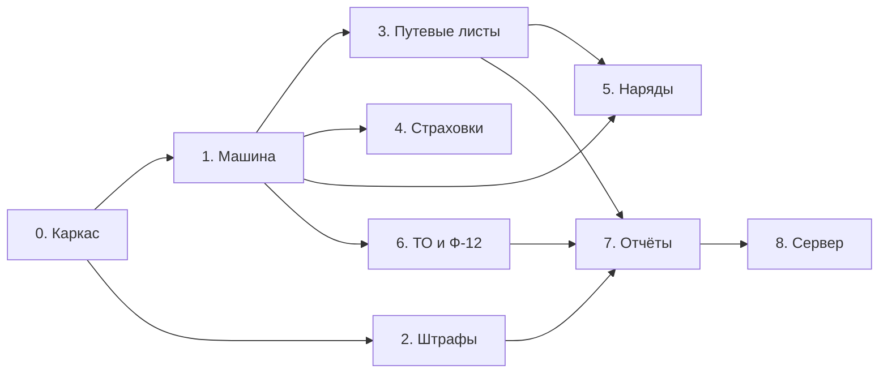

# ParkApp — план реализации

Основан на `docs/DESIGN.md` и требованиях `docs/requirements/AutoPark.md`.

Оценки — в «человеко-днях» студенческой загрузки (≈3–4 ч в день), для ориентира, а не для обязательств.

Порядок этапов подчинён одному принципу: **сначала то, на что опираются остальные** (машина, вложения, общий каркас UI), потом справочники, потом генерация документов, в конце — сервер.

---

## Обзор

| Этап | Содержание | Оценка | Статус |
|---|---|---|---|
| 0 | Каркас: команды, диалоги, вложения, техдолг | 2 д | **частично сделано** (в прототипе штрафов) |
| 1 | Машина: полная карточка + сканы | 3 д | план |
| 2 | Штрафы: доведение прототипа | 1 д | **прототип готов** |
| 3 | Путевые листы | 2 д | план |
| 4 | Страховки + контроль сроков | 2 д | план |
| 5 | Наряд на выход техники | 2 д | план |
| 6 | ТО: заявки + акт Ф-12 в Word | 4 д | план |
| 7 | Отчёты и печать | 2 д | план |
| 8 | Переезд на сервер (БД + сеть) | 5 д | будущее |

---

## Этап 0. Каркас приложения

**Зачем:** без общих кирпичей каждый следующий справочник пишется с нуля.

- [x] `RelayCommand` — реализация `ICommand` для кнопок.
- [x] `AppServices` — единая точка сборки зависимостей.
- [x] `AppPaths` — каталог данных и сканов в одном месте.
- [x] `IScanStorage` + `FileScanStorage` — «вложить / открыть / удалить» скан.
- [x] `IFileDialogService` — выбор файла, отвязанный от ViewModel.
- [x] `IFineDialogService` — открытие модального редактора из VM (шаблон для остальных).
- [ ] Устранить техдолг из DESIGN §12, пп. 1–4, 6: сохранение сида машин, `CS1998`, `null` из десериализации, чистка `using` в `MainWindow.xaml.cs`, try/catch в `async void`.
- [ ] Общий стиль окон-списков (`Styles.xaml` в `App.xaml`).

**Критерий приёмки:** новый справочник добавляется без копирования инфраструктурного кода.

---

## Этап 1. Машина — полная карточка

**Зачем:** сейчас в `Car` меньше половины полей из требований; на машину ссылаются все остальные сущности.

- [ ] Дополнить `Car`: `Pfm`, `Pts`, `RegCertificate`, `PowerKw`, `PowerHp`, `Affiliation` (Гараж/Обеспечение), `Odometer`.
- [ ] `Affiliation` — новый enum; уточнить О-5.
- [ ] Уточнить `Location` (О-1) и при необходимости переименовать значения enum.
- [ ] `CarEditWindow`: поля + редактор списка ГРЗ (добавить/удалить, тип войсковой/гражданский).
- [ ] Валидация: VIN 17 символов и уникален, год в диапазоне, ≥1 ГРЗ, мощность > 0.
- [ ] Вложения машины: СРТС, ПТС — несколько сканов, список со ссылками (требование «при открытии информации машины выдаёт ссылки на PDF»).
- [ ] Фильтр по местонахождению в главном окне (задействовать существующий `CarService.GetByLocationAsync`).
- [ ] Поиск по ГРЗ / VIN / модели.

**Критерий приёмки:** машину можно завести, отредактировать, приложить к ней 2 скана и найти по любому её номеру.

---

## Этап 2. Штрафы — доведение прототипа

**Сделано в прототипе:**

- [x] `Fine` — все поля из требований.
- [x] `IFineRepository` + `JsonFineRepository` (`fines.json`).
- [x] `FineService`: CRUD, фильтрация, итоговая сумма, валидация, список известных водителей.
- [x] `FinesWindow`: список, фильтры (машина, водитель, период, текст), итог по сумме.
- [x] `FineEditWindow`: форма, выбор машины, вложение и открытие скана постановления.
- [x] Кнопка «Штрафы» в главном окне.

**Осталось:**

- [ ] Сортировка списка по клику на заголовок колонки.
- [ ] Штрафы конкретной машины прямо из карточки машины (после этапа 1).
- [ ] Решить О-4 (статус оплаты) и, если нужен, добавить `IsPaid` + `PaidDate` + фильтр «неоплаченные».
- [ ] Экспорт списка в Excel/CSV для сверки.

**Критерий приёмки:** делопроизводитель вносит постановление со сканом за минуту и видит сумму штрафов по водителю за квартал.

---

## Этап 3. Путевые листы

- [ ] `Waybill` + репозиторий (`waybills.json`).
- [ ] Окно-список с фильтром по машине и периоду.
- [ ] Редактор: дата+время начала и конца двумя контролами.
- [ ] Правила: `EndAt > StartAt`; запрет пересечения периодов для одной машины.
- [ ] Индикатор «машина в рейсе» (`EndAt` пуст) в списке машин.
- [ ] Автоувеличение `Car.Odometer` при закрытии путевого листа (по `OdometerEnd`).

**Критерий приёмки:** видно, какие машины сейчас в рейсе, наработка обновляется без ручного ввода.

---

## Этап 4. Страховки

- [ ] `Insurance` + репозиторий, уникальность номера полиса.
- [ ] Редактор + вложение скана ОСАГО.
- [ ] Правило `EndDate > StartDate`.
- [ ] Экран/плашка «истекают в течение 30 дней», подсветка просроченных в списке машин.

**Критерий приёмки:** ни один полис не истекает незамеченным.

---

## Этап 5. Наряд на выход техники

- [ ] `DispatchOrder` + репозиторий, одна запись на дату.
- [ ] Редактор: дата + отметка машин чекбоксами из общего списка.
- [ ] Проверка при выдаче путевого листа: машина есть в наряде на эту дату.
- [ ] Печать наряда (шаблон Word).

**Критерий приёмки:** на любую дату видно разрешённый список, путевой лист вне наряда не выдаётся.

---

## Этап 6. ТО: заявки и акт Ф-12

Самый дорогой этап — здесь генерация документов и формулы.

- [ ] `MaintenanceRequest` + репозиторий, вложение скана заявки.
- [ ] Справочник видов ТО (для генерации текста акта).
- [ ] **Согласовать формулу максимальной наработки (О-2)** — блокирует акт.
- [ ] `MaintenanceAct`: расчёт макс. наработки и остатка.
- [ ] Шаблон `Templates/F12.docx` с плейсхолдерами.
- [ ] Генерация акта через `DocX` (`ReplaceText`), сохранение в `Scans/Maintenance/`.
- [ ] Кнопка «Сформировать акт» из заявки.

**Критерий приёмки:** из заявки одной кнопкой получается заполненный .docx, пригодный к подписи.

---

## Этап 7. Отчёты и печать

- [ ] Штрафы за период: по машинам и по водителям, с итогами.
- [ ] Пробег/наработка по машинам за период.
- [ ] Список техники с истекающими документами.
- [ ] Выгрузка в Word/CSV.

---

## Этап 8. Переезд на сервер

По разделу 10 дизайн-документа.

- [ ] Выбрать СУБД (PostgreSQL или SQL Server Express).
- [ ] Схема БД: суррогатные ключи + `UNIQUE(Vin)`, FK, индексы.
- [ ] `Ef*Repository` вместо `Json*Repository` — прочие слои не трогаются.
- [ ] Сканы на сетевую шару, относительные пути сохраняются.
- [ ] Строка подключения в `App.config`.
- [ ] Утилита разовой миграции JSON → БД.
- [ ] Оптимистичная блокировка (`rowversion`) и проверка на 2 клиентах.

**Критерий приёмки:** два ПК работают с одной базой, правки видны после обновления, конфликты не затирают чужие данные.

---

## Сквозные задачи

- [ ] Логирование ошибок в файл (сейчас исключения теряются).
- [ ] Обработка `DispatcherUnhandledException` — окно с текстом вместо тихого падения.
- [ ] Тесты на валидацию и фильтрацию (отдельный проект, xUnit/NUnit) — они не требуют WPF и потому дёшевы.
- [ ] Резервное копирование каталога данных при старте (последние N копий).
- [ ] README со сборкой и запуском.

---

## Порядок и зависимости

Этапы 3, 4, 6 после этапа 1 независимы — их можно делать в любом порядке или параллельно.

---

## Риски

| Риск | Влияние | Что делаем |
|---|---|---|
| Формула наработки (О-2) не согласована | этап 6 стоит | запросить норматив до начала этапа 6; заготовить интерфейс `IMaxOdometerCalculator` |
| JSON не тянет объём / нужен второй ПК | переделка хранения | слои уже разделены, меняется только `Infrastructure` |
| Строковый водитель не сходится в отчётах (опечатки в ФИО) | отчёты по водителям кривые | автодополнение из введённых значений уже в прототипе; при росте — справочник |
| Старый формат csproj — файлы забываются в сборке | «у меня не компилируется» | правило: новый файл = запись в `.csproj` в том же коммите |
| Сканы разрастаются на диске | место на ПК | хранить относительные пути, вынести `Scans/` на шару на этапе 8 |
